+++
title = "コマンドプロンプト"
# linkTitle="cmd"
description = ""
weight = 10
alwaysopen = true
+++

flask は，コマンドプロンプトを用いて操作する．

## MS Windows におけるディスクの構造

### ドライブ

Microsoft Windows においては，ディスクは，1つまたは複数の __ドライブ__ (drive) から
構成されている．ドライブは，アルファベット1文字の後にコロン (`:`)
を付して表される．

例
* `C:`  ... ドライブC
* `F:`  ... ドライブF

### ディレクトリ

各ドライブでは， __ファイル__ (file) は，
__ディレクトリ__ (directory) と呼ばれる構造を用いて管理される．
ディレクトリのことを，__フォルダ__ (folder) とも呼ぶ．

* 各ドライブには，__ルートディレクトリ__ (root directory) と呼ばれる
  ディレクトリが存在する．ルートディレクトリは，バックスラッシュ (`\`)
  で表す．
  * 環境によっては，バックスラッシュが，円記号に替わっていることもある．
* 各ディレクトリには，ディレクトリおよびファイルを格納することができる．
* ディレクトリ p にディレクトリ s が格納されているとき，
  s を p の __サブディレクトリ__ (subdirectory) と呼ぶ．
  p を s の __親ディレクトリ__ (parent directory) と呼ぶ．

例: あるPCのドライブCには，下図のようにファイルとディレクトリが存在する．




この図において，箱はディレクトリを示し，楕円はファイルを示している．
また，箱どうしや箱と楕円を結ぶ線は，上のディレクトリが下のディレクトリや
ファイルを格納していることを示している．

たとえば，Users はルートディレクトリのサブディレクトリであり，
d3 の親ディレクトリは d2 である．

このように，各ドライブでは，
ルートディレクトリをその頂点 (もしくは末尾) として，
ディレクトリ (およびファイル) の階層構造が構成される．

### 絶対パス

あるドライブに存在するファイルやディレクトリは，
それを格納しているディレクトリを順にたどっていくことによって，
そのドライブのルートディレクトリに到達する．
これを逆順に表記することで，そのファイルやディレクトリの
格納位置を示すことができる．これを，そのファイルやディレクトリの
__絶対パス__ (absolute path) と呼ぶ．
ディレクトリやファイルの区切りには，バックスラッシュを用いる．
ただし，ルートディレクトリと，
それが格納しているディレクトリやファイルとの間には区切りを置かない．

上図におけるいくつかのファイルやディレクトリの絶対パスを示す．

* `\Users\Administrator\Music\quux.mp3`
* `\Windows\system32`
* `\Users`
* `\`

特に，ルートディレクトリの絶対パスは，`\` であることに注意する．

### 相対パス

絶対パスを用いれば，
ドライブ内の任意のファイルやディレクトリの位置を示すことができる．
しかし，しばしば絶対パスは長い文字列となるので，
実用上不便であることも多い．
たとえば，上図の foo.txt の絶対パスは
`\Users\Administrator\Documents\d1\foo.txt` であるが，
現在 「`\Users\Administrator\Documents` に着目している」という
共通理解のもと，着目している部分を省略して，単に `d1\foo.txt` で
済ませることができれば便利である．この記法を
__相対パス__ (relative path) と呼ぶ．
この「着目しているディレクトリ」のことを
__現在のディレクトリ__ (current directory) と呼ぶ．

絶対パスと相対パスを合わせて __パス__ (path) と呼ぶ．

例:
* `d2\bar.txt`
* `d1`

相対パスの先頭にはバックスラッシュが無い．一方，
絶対パスの先頭には必ずバックスラッシュがある．つまり，先頭文字を見ることで，
絶対パスと相対パスを区別することができる．

以下，引き続いて現在のディレクトリを
`\Users\Administrator\Documents` とする．
上の説明だけだと，相対パスでは，
現在のディレクトリよりも下方にあるファイルやディレクトリしか表せない．
そこで，親ディレクトリを表す記法 `..` を導入する．これを用いれば，
ドライブに存在する全てのファイルやディレクトリが，
相対パスで表記できるようになる．

例:
* ディレクトリ Administrator の相対パスは `..` である．
* ルートディレクトリの相対パスは `..\..\..` である．
* ファイル quux.mp3 の相対パスは `..\Music\quux.mp3` である．
* ディレクトリ system32 の相対パスは `..\..\..\Windows\system32` である．

さらに，`.` によって，現在のディレクトリを表す．

同じファイルやディレクトリの相対パスは，複数個ありうる．
以下はすべて同一のディレクトリd1の相対パスである．

* `d1`
* `.\d1`
* `..\Documents\d1`
* `..\.\.\Ducuments\.\.\.\d1\.`

### ドライブ指定

パスを用いれば，
ドライブ内のファイルやディレクトリの位置を指定することができる．
ドライブも指定する場合には，ドライブ文字とコロンをパスの先頭に付加する．
絶対パス，相対パスのいずれを用いることもできる．

例:

* `C:\Windows\system32`
* `C:d1\foo.txt`
* `F:\memo.txt`

MS Windows においては，
各プロセスは，__現在のドライブ__ (current drive) を保持している．
また，各ドライブについて，現在のディレクトリを保持している．
パスにドライブ名が指定されていない場合には，現在のドライブを
参照して解決される．
相対パスは，
ドライブごとに保持されている現在のディレクトリを参照して解決される．



1. 上図で，次のファイルやディレクトリの絶対パスを書け

    1. `Windows`
    2. `d4`
    3. `baz.txt`

2. 上図で，カレントディレクトリをd2とするとき，
   次のファイルやディレクトリの相対パスを書け．

   1. `bar.txt`
   2. `baz.txt`
   3. `Administrator`
   4. `fred.mp3`
   5. `d2`




## コマンドプロンプト

### 起動

コマンドプロンプトは，Windows のスタートメニューから起動することができる．
名前で起動する場合には `cmd` を用いる．

### プロンプト

コマンドプロンプトが利用者からの入力を受け付ける際には，
__プロンプト__ (prompt) を表示する．
(デフォルトでは) プロンプトは次を並べたものである．

* 現在のドライブにおける現在のディレクトリの絶対パス
* 文字「`>`」

例:

```
C:\Users\Administrator>
```

### 現在のディレクトリの変更

コマンドプロンプトで，現在のディレクトリを変更するには，___cd___ コマンド
を用いる (Change Directory)．

絶対パスを指定することで，任意のディレクトリに移動することができる．
プロンプト表示がどう変わるか観察せよ．

```
cd C:\Windows\system32
cd C:\Users\Administrator\Documents
```

相対パスを指定することもできる．

```
cd ..
cd Downloads
```

### ディレクトリの表示

現在のディレクトリを表示するには，___dir___ コマンドを用いる．

```
dir
```

`/w` オプションを使えば，短く表示できる．

```
dir /w
```

引数を与えると，任意のディレクトリを表示できる．

```
cd C:\Users\Administrator
dir Documents
dir /w C:\Windows
dir /w C:\
dir ..
```

他にもいろいろオプションがある．

```
dir /?
```

### ファイル名補完

コマンドに与える引数を途中まで入力してタブキーを打つと，
そこまでの入力と一致するディレクトリ・ファイル名に展開される．
この機能を，___補完___ (completion) と呼ぶ．

### コマンド履歴

カーソルキー上下によって，コマンドの履歴が呼び出せる．

途中まで入力してファンクションキー8番を押すと，そこまでの入力と
一致する履歴が呼び出せる．

### アプリケーションの起動

ファイルに関連付けられているアプリケーションを起動するには，
___start___ コマンドを用いることができる．
指定するファイルはすでに存在しなければならない．

```
start abcd.docx
start foo.xlsx
```


### エクスプローラとの連携

エクスプローラのアドレスバーの左端アイコンを，
コマンドプロンプトにドラッグアンドドロップすると，
ディレクトリの絶対パスを入力することができる．
長い絶対パスを持つディレクトリに移動したいときには，
`cd`に引き続いてスペースを入力した後に，
これを実行するのが便利である．

反対に，
コマンドプロンプトで 「`start .`」 を実行すると，現在のディレクトリを
エクスプローラで開くことができる．
エクスプローラが，ディレクトリ「に関連付けられているアプリケーション」である．



エクスプローラ上で次のように表示されているディレクトリの
絶対パスを答えよ．

1. ドキュメント
2. ダウンロード
3. ピクチャ
4. デスクトップ



