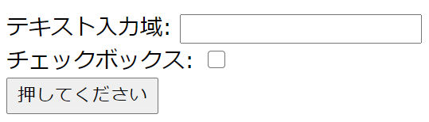

+++
title = "フォーム"
description = ""
weight = 40
+++

ブラウザ上でユーザに入力を行わせるためには，
`<form>`タグを用いて，フォームを作成する．

[この節で用いるソースファイルのダウンロード](form.zip)

### ユーザ入力部品

`<form>`から`</form>`までに間に，さまざまなユーザ入力のための
部品を置くことができる．
以下に，この講義資料中で使用する部品について，コードとその外見を示すが，
他にも多数の利用可能な部品がある．

ソース: form1.py

```python
@route('/')
def func_root():
    return template('form1')
```

ソース: form1.html

```html
    <form action="/act1" method="POST">
      <input type="hidden" name="key1" value="value1"/>
      テキスト入力域: <input type="text" name="text1" /><br/>
      <input type="checkbox" name="cb1" value="yes" />: チェックボックス<br/>
      <input type="submit" value="押してください"/>
    </form>
```



どの部品も，input タグによって作成されている．
type属性の値によって，部品の形状と機能が区別される．

* `type="text"`: 1行のテキスト入力域
* `type="checkbox"`: チェックボックス
* `type="submit"`: 送信ボタン
* `type="hidden"`: 付加情報

### flaskスクリプト

送信ボタン `<input type="submit" ...` が押されると，
form の action 属性で指定されている URL に，
form に入力したデータが送られる．

上の例では，
現在実行中の flask スクリプトの `@app.route('/act1')` エントリの
内容が実行されることになる．

ソース: form1.py

```python
@app.route('/act1', methods=['POST'])
```

http および https プロトコルでは，ウェブサーバへのアクセスには，
2つの種類 (「メソッド」) が規定されている
(他にもあるが，この2つが主に用いられる)．

* GETメソッド
* POSTメソッド

`<a>` タグによるアクセスや，`` タグによるアクセスの場合には，
GETメソッドが用いられる．
`<form>` タグによるアクセスの場合には，`<form>`タグのmethod属性で
どちらを用いるか指定することができる．通常は POST を用いる．
上の `form1.html` では，POSTが指定されている．一方で，下のように
書けば，GET が使用される:

```html
    <form action="..." method="GET">
```

flask スクリプトの `@app.route` は，何も指定しないと，
GET メソッドによるアクセスしか受け取らない．
POSTメソッドによるアクセスを受け付けるためには，以下のいずれかを
行う必要がある．

* 上のように `methods=['POST']` を指定する．この場合，このエントリは
  POSTメソッドのみを受け付け，GETメソッドは受け付けない．
* `methods=['GET', 'POST']` を指定する．この場合，GET メソッドと
  POST メソッドの両方を受け付ける．



以下の2箇所を適当に書き換えて，上の説明の動作を確認せよ．
特に，受け付けられないメソッドに対して，どのようなエラーが報告されるか
確認せよ．

* form1.py の `/act1` に対する method 指定
* form1.html の `<form>` タグにおける method 指定




ソース: form1.py

```python
@app.route('/act1', methods=['POST'])
def func_act1():
    req = request.form
    v_text1 = req.get('text1')       # req['text1'] よりも reg.get('text1') の方が良い
    v_cb1 = req.get('cb1')
    v_value1 = req.get('key1')
    return render_template('form1_result.html',
                           t_text1=v_text1, t_cb1=v_cb1, t_value1=v_value1);
```

flask スクリプト内では `request` というオブジェクトが常に参照可能
になっている．このオブジェクトを通して，ユーザのアクセスに関する
さまざまな情報をえることができる．ここではさしあたり，ユーザが
フォームに入力した情報にアクセスできることが重要である．

request.form は，ほぼ，辞書のように振る舞う．
`<input>` タグなどの `name` 属性に指定されていた値が辞書のキーになり，
ユーザが入力した値が辞書の値になる．
たとえば，HTML のコード `<input type="text" name="text1" />` で
表されるテキスト入力域に，
ユーザがブラウザ上で `hello` と入力したとすれば，この
request.form という辞書に `'text1'` というキーとその値 `'hello'` が
設定されている，という具合である．

辞書 (のようなもの) なので，その値に `req['text1']` という形で
アクセスすることもできる．しかし，これは使わず，上のコードのように，
`req.get('text1')` でアクセスする方が無難である．

取得した値は，たとえば，下のようなテンプレートを用いて
ブラウザに表示させることができる．

ソース: form1_result.html

```html
    <p>以下の値が送信された:</p>
    <ul>
      <li>text1: {t_text1}</li>
      <li>cb1: {t_cb1}</li>
      <li>key1: {t_value1}</li>
    </ul>
```




フォームの入力域の値や，チェックボックスの on/off を変化させて，
form1_result.html の出力がどのように変化するか観察せよ．





上の例を以下の指示に従って改変せよ．

* 初期画面に，「背景色」という名前のチェックボックスを追加する．
* 「背景色」がチェックされている場合には，値の表示画面の背景色を
  白以外の適当な色にする．

(ヒント: 背景色の指定の仕方はいろいろあるが，簡単には，
`<body>` タグの bgcolor 属性に指定すれば良い．例えば，
`<body bgcolor="#FFFFFF">` とすれば，白い背景になり，
`<body bgcolor="#E0FFE0">` とすれば，薄い緑になる．)



### 例

`http://localhost:8088/calc` にアクセスすると，
ユーザが入力した2つの数値の和や差が表示される．

ソース: form1.py

```python
@app.route('/calc')
def func_calc():
    return render_template('form2.html')
```

ソース: form2.html

```html
    <form action="/act2" method="POST">
      数1: <input type="text" name="num1" /><br/>
      数2: <input type="text" name="num2" /><br/>
      計算: <input type="checkbox" name="type" value="sum"> 和，
            <input type="checkbox" name="type" value="product"> 積
	    <br/>
      <input type="submit"/>
    </form>
```

ソース: form1.py

```python
@app.route('/act2', methods=['POST'])
def func_act2():

    req = request.form
```

req.get('...') で得られる値は文字列である．
数として扱いたいのならば，int(...) 等を用いて，変換する必要がある．
もしくは，req.get(key, type=int) を使うこともできる:

```python
    v_num1 = int(req.get('num1'))
    v_num2 = req.get('num2', type=int) 
```

複数のチェックボックスに同じ名前を指定しているときには，
req.getlist() を呼ぶことで，チェックされた値のリストを得ることができる．

```python
    checked = req.getlist('type')
    # print('\n***** checked = ', checked, '******\n')
```

上のコードの場合，

* ユーザが和だけをチェックしていれば，checked の値は `['sum']`
* ユーザが和と積をチェックしていれば，checked の値は `['sum', 'product']`
* どちらもチェックしていなければ，    checked の値は `[]`

などとなる．デバッグ用の print 文を使って，確認することができる．

このことを利用して，以下のように
適切なメッセージを表示することが可能である．

```python
    if len(checked) == 0:
        return render_template('form2_error.html',
                               msg='計算が指定されていません．')
    elif len(checked) >= 2:
        return render_template('form2_error.html',
                               msg='複数の計算が指定されています．')
    elif checked[0] == 'sum':
        return render_template('form2_result.html',
                               t_num1=v_num1, t_num2=v_num2,
                               t_symb='+', t_val=v_num1 + v_num2)
    elif checked[0] == 'product':
        return render_template('form2_result.html',
                               t_num1=v_num1, t_num2=v_num2,
                               t_symb='*', t_val=v_num1 * v_num2)
    else:
        return render_template('error2.html', msg='不正なアクセスです．')
```

ソース: form2_result.html

```html
    <h1>計算結果</h1>
    <p>{t_num1} {t_symb} {t_num2} = {t_val}</p>
```



(1) 和，積の他に差も計算できるように改変せよ．

(2) 数を3つ指定できるように改変せよ．なお，この場合，
差が指定されたら，`数1 - 数2 - 数3` を計算することとする．

(3) 現在のコードでは，「数1」や「数2」のフィールドに，何も入力しなかったり，
数でない文字列 (例えば「`xyz`」) を入力すると，エラーが発生する．
これらの場合に，「入力誤り」画面で，
「数1が数値ではありません」といったメッセージを出すように改変せよ．
(ヒント: 「PythonからMySQLへのアクセス」で扱った「エラー処理」を参照せよ．
今回発生するエラーは MySQLError ではないので，そこを適切に
直す必要がある．ブラウザの画面を見て判断せよ．)




