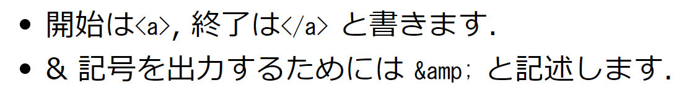
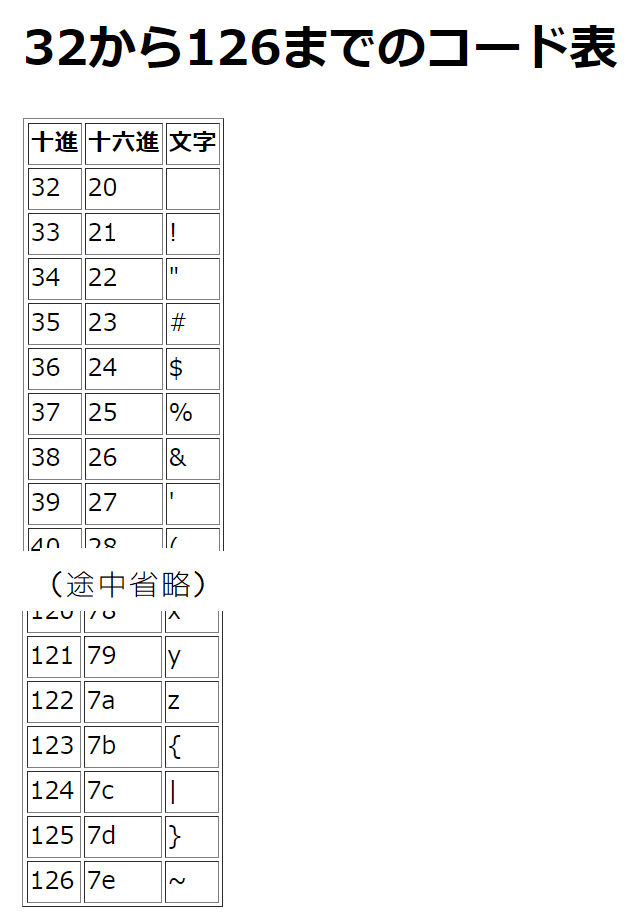

+++
title = "(補足) HTMLエスケープ"
description = ""
weight = 45
+++

## 文字実体参照

HTML では，以下の4つの文字は，そのまま記述しても
正しく機能しない場合がある．
そのような場合，右側に示す符号が用いられることがある．
これを，__文字実体参照__ (character entity reference) と呼ぶ．

| 文字  | 文字符号 |
| :---: | :------: ||
|  <code>&lt;</code>  |  <code>&amp;lt;</code>  |
|  <code>&gt;</code>  |  <code>&amp;gt;</code>  |
| <code>&amp;</code>  | <code>&amp;amp;</code>  |
| <code>&quot;</code> | <code>&amp;quot;</code> |



下のHTMLファイルを修正して，概略次のように表示されるようにせよ．



```html
<!DOCTYPE html>
<html>
  <head>
    <meta charset="UTF-8">
    <title>練習15-1</title>
  </head>
  <body>
    <ul>
      <li>開始は<code><a></code>, 終了は<code></a></code>
    と書きます．</li>
      <li>&記号を出力するためには <code>&amp;</code> と記述します．</li>
    </ul>
  </body>
</html>
```





配布ファイル [exc15-2.zip](exc15-2.zip) を起動して
[http://localhost:8088/](http://localhost:8088/)
にアクセスすると，4つのラジオボタンが表示される．
送信ボタンを押したときに，選択しているボタンの右側に書かれている文字列が
表示されるべきなのだが，最も下にあるボタンだけ機能していない．
ファイル a1.html の(*)をつけた行のみを修正して
(a2.html や exc15-2.py はこのままで)
正しく動作するようにせよ．



## 数値文字参照

Unicode のコードポイントを用いて文字を参照することもできる．
これを，__数値文字参照__ (numeric character reference) と呼ぶ．
数の十進表記 <code><i>nnnn</i></code> を用いて
「<code>&#<i>nnnn</i>;</code>」，
もしくは数の十六進表記 <code><i>hhhh</i></code> を用いて
「<code>&#x<i>hhhh</i>;</code>」の形式で表す
(最後のセミコロンに注意)．

例えば，二重引用符 「`"`」 の Unicode コードポイントは 34 であるから，
この文字は <code>&amp;#34;</code> ないし <code>&amp;#x22;</code>
で表記することができる．

なお，以上のような扱いをする際は，python を便利に用いることができる．
* 関数 ord(c) は，文字 c のコードポイントを返す．
* 関数 chr(n) は，コードポイント n を持つ文字を返す．
* 整数の十六進表記 <code><i>hhhh</i></code> に対して <code>0x<i>hhhh</i></code>
  の表現は，該当の整数を表す．
* 文字列埋め込み <code>f'...{ n }...'</code> において，`n` に引き続いて
  十六進指定文字列 `:x` を書くことによって，
  整数 `n` が十六進表記によって埋め込まれる
  (`n` と `:x` の間にスペースを入れてはいけない)．

```python
print(f'「あ」のコードポイントは { ord("あ") } である．')    # 12354
print(f'コードポイント 12354 を持つ文字は「{ chr(12354) }」である．')   # あ
print(0x22 == 34)     # True
print(f'整数34の十六進表記は，{ 34:x } である．')    # 22
```



ブラウザ上で以下のように表示されるHTMLファイルを作成せよ．






## flask のテンプレートにおけるエスケープ

flask のテンプレートで `{ ... }` による埋め込みが行われる際には，
一般的に適切と考えられる文字参照が行われる．

例えば，次のテンプレート:

```html
    フィードバックコメント: { comment }
```

に対して，

```python3
    ...
    return render_template('a1.html', comment='x<y ではなく x<=y です')
```

を実行した場合，埋め込まれる文字列は，
「`x&lt;y ではなく x&lt;=y です`」になり，
その結果，人間に読める形で表示されることになる．
指定した文字列がそのまま埋め込まれたら，
(ブラウザにもよるが) 3文字目の「<」以降の文字は表示されないであろう．

文字参照を行わずに，
指定した文字列をそのまま埋め込みたいと考えることがあるかもしれない．
flask には，そのままの埋め込みを行う機能もある．
しかし，ほとんどの場合には，そうせずに回避することが可能である．
そのままの埋め込みを行うことは一般に危険であり，
これに起因した __セキュリティ上の問題__ が，これまで数多く発生している．
事情が良く分かるまでは，行わないのが無難である．
