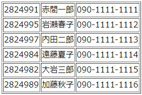

+++
title = "テンプレート(2)"
description = ""
weight = 50
+++

* この節で使うソースを格納した[zipファイル](templ2.zip)
* flask スクリプトは，templ2.py

テンプレートでも，条件判定と繰り返しを行うことができる．

### % 記法

Jinja2テンプレートの中では，以下の特殊な区切りが用いられる:

* `` : Python の文を書ける．
* `{ ... }` : Python の式の値が挿入される．(すでに前々節で見た)
* `{# ... #}` : コメントが書ける．

Python では，if や for や def の範囲を指定するために，
インデントが用いられた．しかし，
テンプレート中では ___インデントは無視される___．
また，「そこからインデントが深くなる」ことを表す
___コロン (:) は用いられない___．

* `for` のブロックの終わりには `endfor` というキーワードをおく．
* `if` -- `elif` -- ... -- `else` ブロックの終わりには，`endif` という
  キーワードをおく．

### if文

典型的には，テンプレート中では if 文は以下のように使用される:

```html

    <p>おはよう</p>

    <p>こんにちは</p>

    <p>おやすみ</p>

```

変数 t_time の値が 'morning' ならば，「おはよう」と，
'afternoon' ならば，「こんにちは」と，いずれでもなければ
「おやすみ」という表示が行われる．

### 例題

前節の計算の例では，計算を表すチェックボックスは1つしか選択できなかった．
これを，いくつでも選択できて，
選択されている計算はすべて実行して表示されるように改変してみよう．

flask スクリプトからテンプレートへ，リスト v_checked を，そのまま渡す．
また，v_cnt として，v_checked の長さを渡す．

```python
    v_cnt = len(v_checked)
    return render_template('templ2_result.html', t_checked=v_checked,
                           t_num1=v_num1, t_num2=v_num2, t_num3=v_num3,
                           t_cnt=v_cnt)
```

テンプレートの中では，
各計算の識別子 (`sum`, `product`, `difference`) が
リスト t_checked に現れるかどうかチェックし，現れる場合には，
該当する計算式とその結果を表示する．リストに現れない場合には，
何も表示されない．

和・差・積それぞれについて処理をした後で，cnt の値をみて
メッセージを表示する．

```html
    
        <p>全部で { t_cnt } 件の計算を行いました．</p>
    
        <p>計算が指定されていません．</p>
    
```



templ2.py を走らせている状態で
`http://localhost:8088/exc_course` にアクセスした際表示される画面で
送信ボタンを押したとき，
おおむね次のように表示されるようにコードを作成せよ．

2つのチェックボックスが，ともにチェックされたとき

```
次の科目を履修します．
・ 外国語科目: フランス語
・ 共通科目: 法学
```

(上の「フランス語」や「法学」のところは，ユーザが入力した科目名に
置き換える):

2つのチェックボックスのうち，1つだけチェックされたとき

```
次の科目を履修します．
・ 外国語科目: フランス語
```

(上では外国語科目がチェックされた例を示したが，
共通科目がチェックされたときも同じようにする)

どちらもチェックされなかったとき

```
履修する科目はありません．
```



### for文

典型的には，テンプレート中では for 文は以下のように使用される:

```html
<ul>

    <li>{ x }</li>

</ul>
```

テンプレートが 
`render_template(..., t_list=['文学部', '歯学部', '短期大学部'])`
と呼び出されるとすると，この部分からは，
次のような HTML が生成されることになる:

```html
<ul>
    <li>文学部</li>
	<li>歯学部</li>
	<li>短期大学部</li>
</ul>
```

データベースにアクセスする場合など，
表形式での出力を行いたくなるケースが頻繁にある．
このような場合，二重リスト (リストのリスト) を処理することになる．

たとえば，次のように定義されるリストがあったとしよう

```python
students= [['2824991', '赤間一郎', '090-1111-1111'],
           ['2824995', '岩瀬春子', '090-1111-1112'],
           ['2824997', '内田二郎', '090-1111-1113']]
```

これを，`template(..., t_lst=students)` の呼び出しでテンプレートに
渡して，表として表示させる場合，以下のようなコードになる:

```html
<table border="1">
  
      <tr>
        
		    <td>{ t }</td>
        
      </tr>
  
</table>
```

t_lst は，テンプレート呼び出し時に与えられる変数だが，
row と t は，ここで導入した変数である．
外側の for 文では，変数 row に，次のように値が設定される:

* 最初の実行時: `row = ['2824991', '赤間一郎', '090-1111-1111']`
* 2回目の実行時: `row = ['2824995', '岩瀬春子', '090-1111-1112']`
* 3回目の実行時: `row = ['2824997', '内田二郎', '090-1111-1113']`

内側の for 文では，変数 t に，次のように値が設定される．

* 外側のループの最初の実行時: 
    * 内側のループの最初の実行時: `t = '2824991'`
    * 内側のループの2回目の実行時: `t = '赤間一郎'`
    * 内側のループの3回目の実行時: `t = '090-111-1111'`
* 外側のループの2回目の実行時: 
    * 内側のループの最初の実行時: `t = '2824995'`
	* ...
* ...




上を実行した場合に生成されるHTMLコードを書き下してみよ．



### 例題

`http://localhost:8088/` の画面下部に
行数と列数を
入力すると，かけ算の表が表示される．フォームのコードは以下の通り:

```html
    <form action="/act3" method="POST">
      行数: <input type="text" name="row" /><br/>
      列数: <input type="text" name="col" /><br/>
      <input type="checkbox" name="with_header" value="yes"> 見出し<br/>
      <input type="submit"/>
    </form>
```

flask スクリプトの act3 では，以下のように進行する．
まず，送られた値を設定する．row と col は数値として扱いたいので，
`int()` をつけていることに注意する (エラー処理は省略している)．

```python
    row = int(req.get('row'))
    col = int(req.get('col'))
    with_header = req.get('with_header')
```

「見出し」のチェックを付けていないときには，`with_header` の値は
None であり，この場合には，
表示すべき値は，リストのリストとして，以下のように組み立てられる:

```python
    multiples = []
    for r in range(1, row + 1):
        m_row = []
        for c in range(1, col + 1):
            m_row.append(r * c)
        multiples.append(m_row)
```

実際にどのようなリストが組み立てられたのか，下の print 文を
アンコメントして確認してみること．コマンドプロンプトに表示される．

```python
    # print('\n****** multiples = ', multiples, '******\n')
```

単純に表示してみよう:

```python
        return render_template('templ2_multiples_result.html', 
                               multiples=multiples)
```

```html
    <table border="1">
      
        <tr>
          
            <td align="right">{ m }</td>
          
        </tr>
      
    </table>
```

見出しにチェックが付けられると，`with_template` の値が None ではなくなる．
この場合，先頭行と最左列に見出しをつける．

テンプレートの中で値を作成することもできるけれども，
できるだけ，flask スクリプトで値を生成しておいて，
テンプレートの処理はなるべく単純にする方が良い．

flask スクリプトでは，先頭行を header というリストに格納する．

```python
        header = []
        for c in range(1, col + 1):
            header.append(c)
```

残りの行については，見出しとデータのリストをペアにして，
リスト `multiples` に格納する．

```python
        for r in range(1, row + 1):
            m_row = []
            for c in range(1, col + 1):
                m_row.append(r * c)
            multiples.append((r, m_row))
```

この結果，たとえば次のようなデータが生成されることになる．

```
header ===> [1, 2, 3, 4]
multiples ===> [ (1, [ 1,  2,  3,  4]),
                 (2, [ 2,  4,  6,  8]),
                 (3, [ 3,  6,  9, 12]),
                 (4, [ 4,  8, 12, 16]) ]
```

これらをテンプレートに渡す．
今までの例では (初めてだったので混乱しないように)，flask スクリプト側と
テンプレート側で変数名を分けていたが，面倒でやっていられないので，
普通は同じ名前を使う．

```python3
        return render_template('templ2_multiples_result_wh.html', 
                               header=header, multiples=multiples)
```

テンプレートの中で，これらを表示する．

まず，先頭行を表示する．最左列は空欄であり，その他の列には，`header` として
渡した値を表示する．

```python
        <tr>
            <th></th>                        {# 最左列 #}
          
            <th align="right">{ h }</th>
          
        </tr>
```

2列目以降も表示する．
テンプレートに渡されるリスト `multiples` の要素は，
見出し用の数値 `r` と，残りの値 `m_row` との組であったので，
for 文はそのように受ける．
`m_row` の個々の値は，内側の for 文で展開する．

```python
      
        <tr>
            <th align="right">{ r }</th>    {# 最左列 #}
          
            <td align="right">{ m }</td>    {# データ部分 #}
          
        </tr>
      
```


### 注意事項

テンプレートでも if, for などが使えるので，これらを用いて
かなり複雑な処理をテンプレート中に書くことができる．しかし，
これはあまり勧められない．データに関する複雑な処理は flask スクリプト内に
記述して，テンプレートでの処理は，表示に関することだけに
限定するようにすべきである．そうすれば，テンプレート中で
それほど複雑な処理を記述しなくてもすむ (ことが多い)．




templ2.py を起動して
`http://localhost:8088/exc_course` にアクセスしたときに表示される
画面に関して，下の問に答えよ．

(1)
「学生情報(全表示)」の送信ボタンを押したとき，概ね以下のような
表示が行われるようにせよ．(templ2.py の中のstudentsリストを使う)



(2)
「学生情報(ヘッダ付き)」の送信ボタンを押したとき，上の表の
先頭行に「学籍番号」「氏名」「電話番号」が表示されるようにせよ．

(3)
「学生情報(選択表示)」の送信ボタンを押したとき，選択した学生の行のみが
(先頭行の「学籍番号」「氏名」「電話番号」とともに)
表示されるようにせよ．


