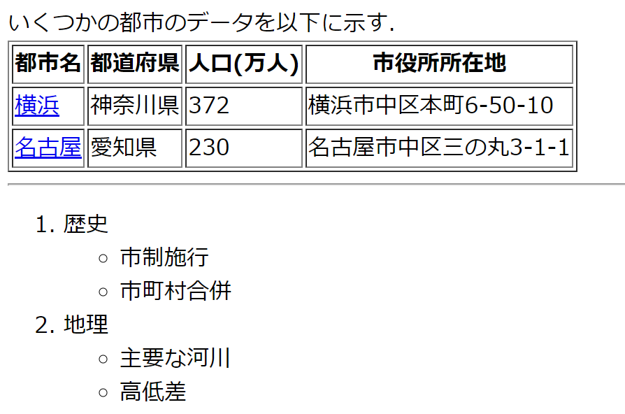

+++
title = "HTMLの復習"
description = ""
weight = 10
alwaysopen = true
+++

この科目で用いる，必要最小限のHTMLの知識についてまとめる．

## 全体構成

HTMLファイルは，次のような構造を持つ．

```
<!DOCTYPE html>
<html>
  <head>
    <!-- ヘッダ部分-->
  </head>
  <body>
    <!-- 本体-->
  </body>
</html>
```

## ヘッダ

ヘッダ部分には様々な情報が書けるが，この講義では，次を記述しておけば良い．
```
<meta charset="UTF-8">
<title>タイトル</title>
```

この演習で用いるファイルはUTF-8でエンコードされるようにする．
自分の使用しているテキストエディタにおいて，どのようにすれば良いか
確認しておくこと．

注意: TeraPad では，`UTF-8` を選択してはならない．これは，
世の中で通常 UTF-8 エンコードと言っているものとは異なる形式である．
TeraPad を利用する場合は，`UTF-8N` を選択すること．
なお，TeraPadの利用は推奨しない．NotePad++ や Atom を利用する方が良い．

タイトル部分は，そのページのタイトルを記入するようにする．

## よく用いるタグ

本体部分 (`<body>～</body>`) でよく用いるタグに，以下のものがある．
これらは使いこなせるようによく復習しておくこと．

| タグ      | 意味                      |
| --------- | ------------------------- |
| `<br>`    | 改行                      |
| `<hr>`    | 水平線                    |
| `<a>`     | リンク                    |
| `<ol>`    | 番号付き列挙              |
| `<ul>`    | 箇条書き                  |
| `<li>`    | `<ol>`や`<ul>`の項目      |
| `<table>` | 表                        |
| `<tr>`    | `<table>`の行             |
| `<th>`    | `<table>`の見出し行の項目 |
| `<td>`    | `<table>`の一般行の項目   |

&nbsp;



ファイル <a href="htmlRev1.html" 
download="htmlRev1.html">htmlRev1.html</a> をダウンロードして
テキストエディタおよびウェブブラウザで開き，各タグの使い方を確認せよ．





以下のような外見を持つHTMLファイルを作成せよ．
ただし，2箇所のリンクにアクセスすると，
それぞれの市の公式ウェブページにジャンプするようにせよ．







